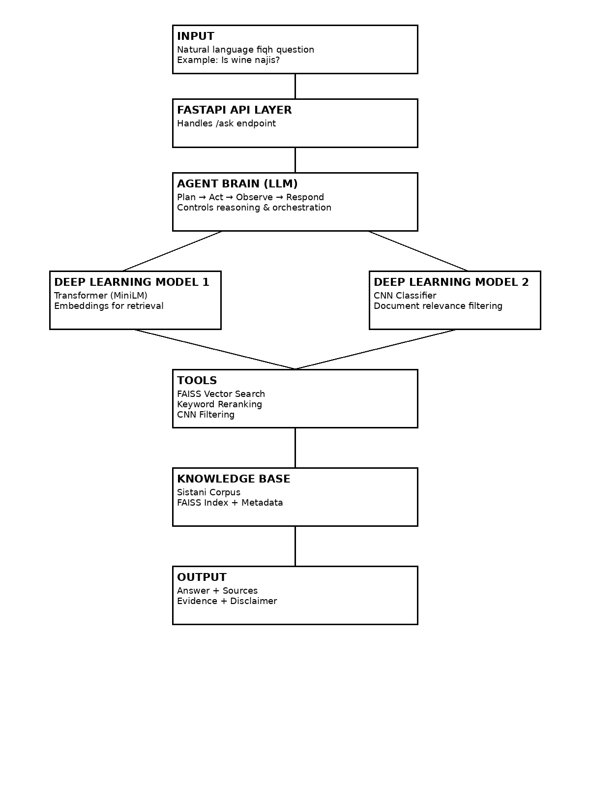

# Ahkam Navigator (Shia Rulings AI Agent)

Ahkam Navigator is an AI-powered agent that answers Shia fiqh (Islamic law) questions using a Retrieval-Augmented Generation (RAG) pipeline combined with structured agent reasoning.

---

## Author

**Solo Project — Ali Zaidi**

---

## 🎯 Problem & Target Users

Many Shia Muslims struggle to quickly find reliable and accurate rulings (ahkam) from authoritative sources such as Ayatollah Sistani. Traditional lookup methods require manually searching through long PDFs, which is time-consuming and error-prone.

This project solves that problem by:

* Allowing users to ask natural language questions
* Retrieving the most relevant rulings
* Generating a structured, understandable answer

**Target Users:**

* Shia Muslims seeking quick fiqh guidance
* Students of Islamic studies
* Anyone needing structured access to religious rulings

---

## 🧠 Project Type

**Option A: Single AI Agent**

This project implements a **single intelligent agent** with:

* A reasoning loop (**Plan → Act → Observe → Respond**)
* Multiple tools (FAISS retrieval, reranking, CNN classifier)
* Retrieval-Augmented Generation (RAG)

---

## 🏗️ Architecture Overview

The system processes a user query through a FastAPI backend, where an agent controls reasoning and tool usage. It retrieves relevant rulings using semantic search and generates a structured response.

### Architecture Diagram



---

## ⚙️ Technologies & Tools Used

## Framework Choice

This project uses a custom FastAPI-based agent framework instead of a prebuilt agent framework such as LangChain. I originally considered LangChain, but I chose a custom structure so I could clearly demonstrate the reasoning loop, retrieval tools, deep learning models, and response generation process.

The agent follows a Plan → Act → Observe → Respond pattern and uses separate tools for FAISS retrieval, keyword reranking, and CNN-based relevance classification.


### Vector Search & Retrieval

* FAISS (vector database)
* Keyword-based reranking

### AI / Deep Learning Components

* **Transformer Model**: `all-MiniLM-L6-v2`

  * Used for semantic embeddings and retrieval
* **CNN Model (PyTorch)**

  * Used for document/page relevance classification

---

## How It Works

1. User sends a question via `/ask`
2. Agent interprets the query
3. Transformer converts query into embeddings
4. FAISS retrieves relevant chunks
5. Keyword reranking improves accuracy
6. (Optional) CNN classifier filters relevance
7. Agent generates structured response

---

## Installation Instructions

### 1. Clone the repository

```bash
git clone https://github.com/azaidi2022/AliZaidi_Solo_ITAI2376.git
cd AliZaidi_Solo_ITAI2376
```

### 2. Create virtual environment

```bash
python -m venv venv
source venv/bin/activate  # Mac/Linux
```

### 3. Install dependencies

```bash
pip install -r requirements.txt
```

### 4. Environment variables

Create a `.env` file based on `.env.example`:

```
OPENAI_API_KEY=
HUGGINGFACE_API_KEY=
```

---

## How to Run the Agent

From the root directory:

```bash
uvicorn main:app --reload
```

Then open:

```
http://127.0.0.1:8000/docs
```

---

## Example Usage

### Example 1

**Input:**

```
Is wine najis?
```

**Output:**

* Direct answer explaining ruling
* Source reference
* Supporting evidence

---

### Example 2

**Input:**

```
When do you pray qasr?
```

**Output:**

* Explanation of travel prayer rules
* Relevant rulings cited

---

### Example 3

**Input:**

```
Does touching alcohol break wudhu?
```

**Output:**

* Clarified fiqh ruling
* Supporting references

---

## ⚠️ Known Limitations

* Only supports **Ayatollah Sistani** dataset (no multi-marja comparison yet)
* CNN model is implemented but not fully integrated into runtime
* No conversational memory (single-turn interactions only)
* Responses depend on quality of retrieved chunks

---

## 🎥 Demo


---

## Knowledge Base

Located in:

```
backend/app/data/
```

Includes:

* Raw PDF (Sistani Islamic Laws 2023)
* Processed corpus (JSON)
* FAISS index

---

## Reflection

See `REFLECTION.md` for:

* What worked well
* Challenges faced
* Future improvements

---

## Future Improvements

* Add multiple maraji (e.g., Khamenei)
* Improve CNN integration into pipeline
* Add conversational memory
* Deploy as web app (frontend UI)

---

## Final Notes

This project demonstrates:

* Retrieval-Augmented Generation (RAG)
* Transformer-based embeddings
* CNN-based classification
* Agent-based reasoning loop

Built as part of **ITAI 2376 Final Project**
